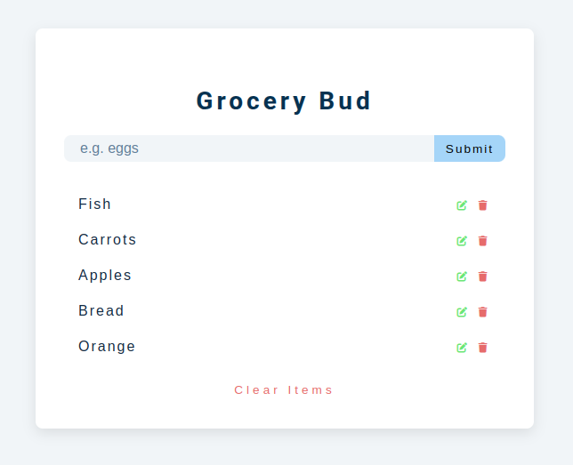

# **Grocery Bud**  
_A Simple and Efficient Grocery List Management App_

## **Project Overview**  
Grocery Bud is a sleek, user-friendly web application designed to simplify grocery shopping and inventory management. Built with **HTML**, **CSS**, and **JavaScript**, this app provides an interactive interface where users can dynamically add, edit, and delete grocery items. The application leverages browser **Local Storage** to ensure data persistence, offering a seamless user experience even after a page reload.

---

## **Key Features**  
- 🛒 **Add and Manage Items**: Quickly add grocery items to your list with a clean, intuitive form interface.  
- ✏️ **Edit Functionality**: Update any item effortlessly with a single click.  
- ❌ **Delete Items**: Remove individual items or clear the entire list in one step.  
- ⚡ **Real-Time Alerts**: Receive instant feedback via success and error alerts for every action.  
- 💾 **Local Storage Integration**: Automatically saves and retrieves your grocery list, ensuring persistent data across sessions.

---

## **Technical Highlights**  
- 📱 **Responsive Design**: Optimized for all screen sizes to provide a consistent experience across devices.  
- 🖱️ **Dynamic DOM Manipulation**: Uses JavaScript to update the DOM in real time without page refreshes.  
- 🎯 **Efficient Event Handling**: Employs robust event listeners for form submission, editing, and deletion of items.  
- 🛠️ **Modular Code Structure**: Clean, readable, and maintainable code following best practices in JavaScript.  

---

## **Why This Project?**  
Grocery Bud showcases essential front-end development skills with a focus on interactivity, UI/UX design, and local storage management. It demonstrates your ability to create practical web applications, making it a valuable addition to your developer portfolio.

---

## **Technologies Used**  
- **HTML5**  
- **CSS3**  
- **JavaScript (ES6+)**  
- **Local Storage API**

---

## **Screenshots**  
 
Example:  


---

## **Getting Started**  
1. Clone the repository:  
   ```bash
   git clone git@github.com:M0hamedGard0ud/Grocery-List.git
   ```
2. Navigate to the project directory:  
   ```bash
   cd Grocery-List
   ```
3. Open the `index.html` file in your browser to see the application in action.

---

## **Contributing**  
Contributions are welcome! Feel free to submit a pull request to enhance the project or fix bugs.

---

## **License**  
This project is licensed under the MIT License. See the [LICENSE](LICENSE) file for details.

---
